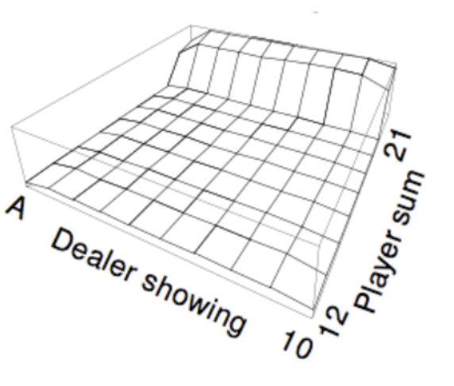

# Monte-Carlo Control in Easy21

Apply Monte-Carlo control to Easy21. Initialise the value function to zero. Use a time-varying scalar step-size of _αt = 1/N(st_, at) and an 𝜖-greedy exploration strategy with _𝜖t = N0/(N0 + N(st))_, where N0 = 100 is a constant, _N(s)_ is the number of times that state s has been visited, and _N(s, a)_ is the number of times that action _a_ has been selected from state _s_. Feel free to choose an alternative value for _N0_, if it helps producing better results. Plot the optimal value function _V*(s) = maxa Q*(s, a)_ using similar axes to the following figure taken from Sutton and Barto’s Blackjack example.

