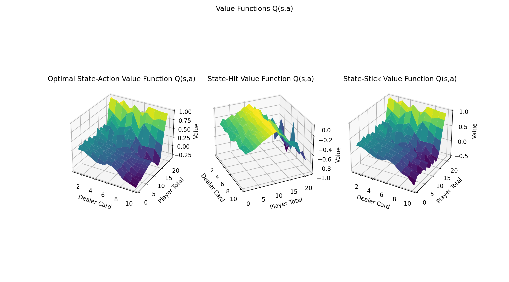
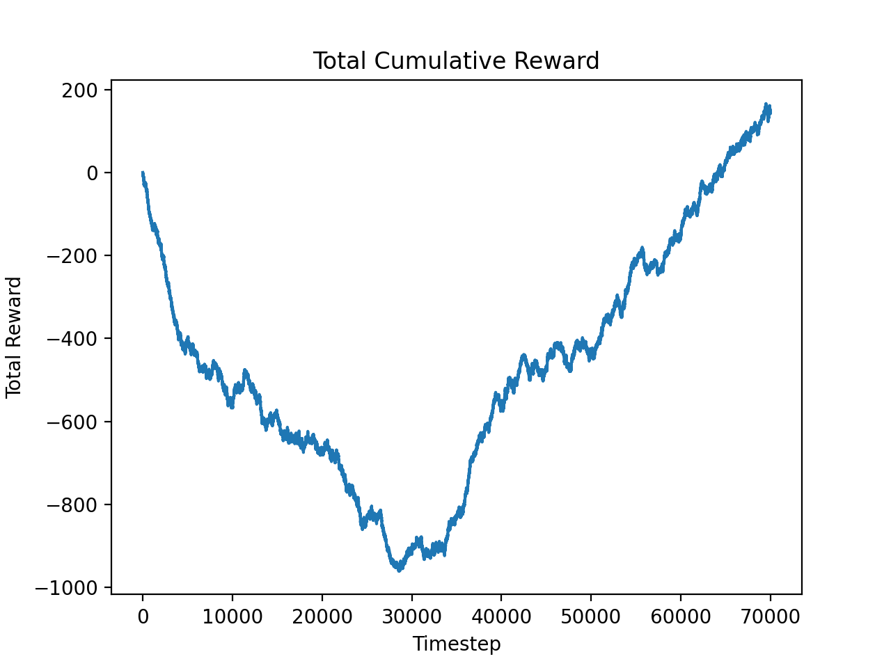
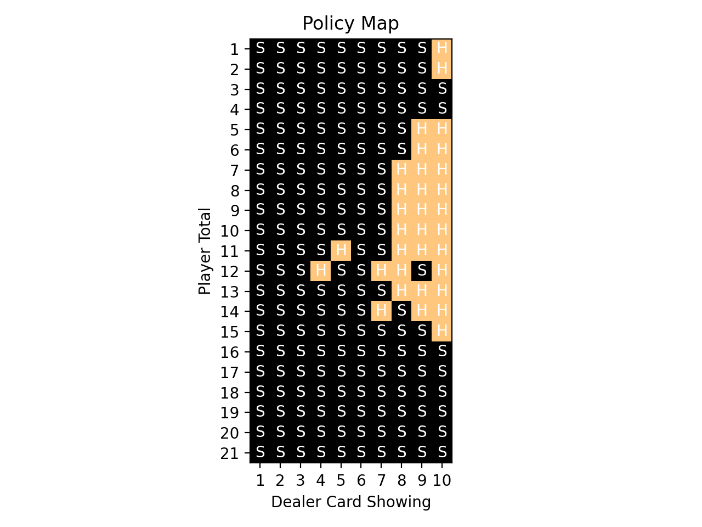

# Assignment 2
### Monte-Carlo Value Iteration

## Objective

The objective for this assignment was to use monte-carlo learning to find the optimal policy and value function needed for an agent to win at the game Easy21. The largest difference in the game of Easy21 from blackjack is that cards will be negative with 1/3 probability. This makes the game much more dynamic and arguably less intuitive for a human to play.

## How it works

Broadly speaking, this technqiue is broken down into two components:

1. Policy Evaluation (Monte-Carlo)
2. Policy Improvement (&epsilon;-greedy)

We sample the results of our current policy using the monte carlo, which is essentially the idea that via the law of large numbers, the mean of the return from a state-action pair, will approach the true value.

By using monte-carlo learning we can sample the result of an episode, and use the outcome to update our value function. 
This follows using the basic update rule of:
 
 
_Q(s,a) &#8592; Q(s,a) + &alpha;(Gt - Q(s,a))_
 

&alpha; is a term we use to update in the direction of the mean (essentially a learning rate).

For policy improvement, the use of &epsilon;-greedy is needed to balance the **exploration vs exploitation tradeoff**. 

The epsilon greedy stategy says that the agent will take the greedy action (action which is predicted to give the largest future total reward) with probability 1-&epsilon;, and a random action with probability &epsilon;.

This is because we want our policy to improve and win, so our agent must act greedily – however until enough experience is had in all state,action pairs, the optimal solution may not be observed yet. As the iterations go on, &epsilon; approaches zero such that we converge on the optimal policy (once enough exploration has been had to confirm that our current policy is optimal.)

## The Results

A brief discussion regarding the results ( < 5 minutes ) is given [here](https://www.loom.com/share/bf46d2fa2d214dfa8d3b46226825bc2a).

Before diving into the results it makes sense to first consider the expectations:
- The agent should find no value in states where it would not act (beyond 21 and below 1)
- The optimal value is when the agent has 21 and the dealer has a low card.
- Lowest value state is when the agent has a high card, and the agent has a value below 17 but close (ex. 16)
- Hitting at a low value (1,2,3) or a high value (19-21) should have very low value return.

As seen in the figure below, many of these expectations are verified, and the discussion given [here](https://www.loom.com/share/bf46d2fa2d214dfa8d3b46226825bc2a). covers them more in depth.

<table>
  <tr>
    <th></th>
  </tr>
  <tr>
    <th>
      Figure 1: Value function after 70k iterations
    </th>
  </tr>
</table>

<table>
  <tr>
    <th></th>
  </tr>
  <tr>
    <th>
      Figure 2: Total cumulative reward after 70k iterations
    </th>
  </tr>
</table>

<table>
  <tr>
    <th></th>
  </tr>
  <tr>
    <th>
      Figure 3: Policy Map after 70k iterations
    </th>
  </tr>
</table>

Looking at *figure 1* we see the value function for this problem. At first glance it may be intimidating but upon further reflection it makes plenty of sense. First observations is that the optimal value function adn the stick value funciton look almost identical, and thats because stick is the only terminal action. Since a player can't win on a hit (only lose) the best reward that one can receive in a hit action is 0, and the worse is -1. Conversely when you stick, you can win up to 1 reward point, so whenever we win, we stick. Looking at *figure 3* makes it clear what moves are preferred to win, but some intuition to connect it with *figure 1* is that states where the player total is highest and dealer card is lowest has the highest value. Similarly, this is the case for when the dealer has a very low showing card, and the player total is in safe (non-bust) zone.

In fact, its only worth to hit when the player total is far away from the bust zone (a value of under 10-11). At this point a player has the most incentive to hit, and this curve is skewed slightly towards the positive totals rather than negative, because negative cards are only drawn with 1/3rd probability.

Taking a look at *figure 2*, it becomes obvious that there is an inflection point in the reward (around 30k iterations, where the tangent = 0). From this point the agent mostly wins at a linear rate, signaling that it is not improving much in terms of policy (even though the value function is updating).  

Finally, looking at *figure 3* we see that the policy map confirms intuitions and expectations as described earlier. 

