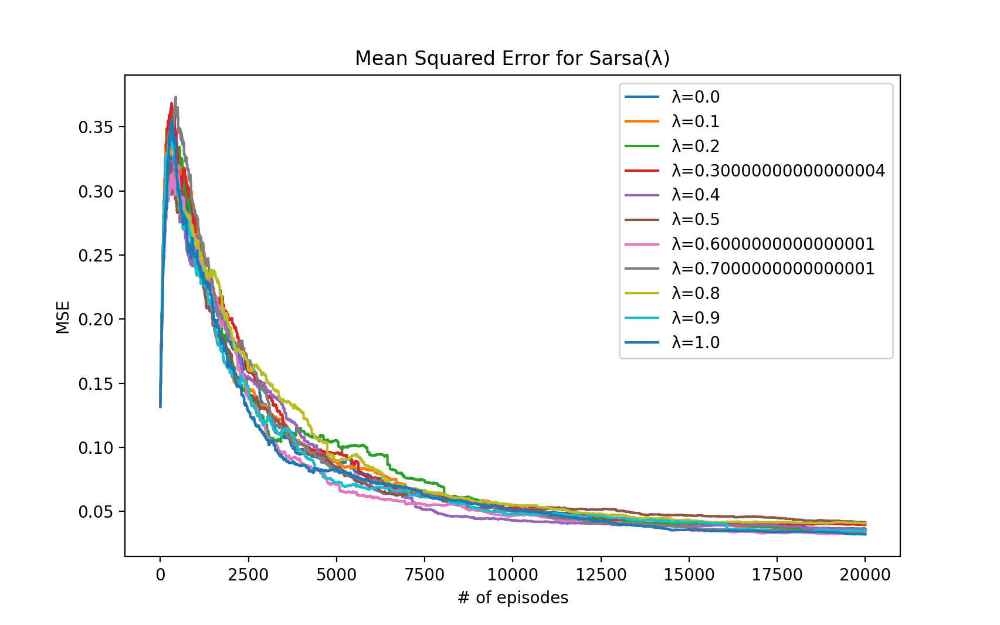
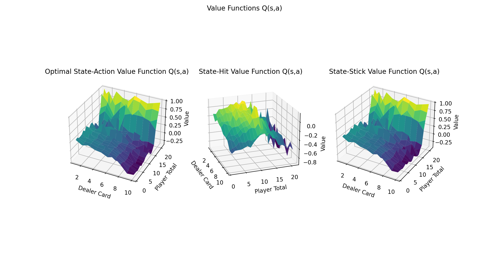
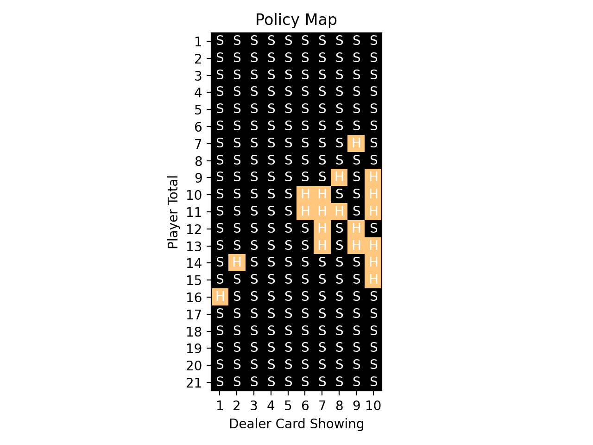

# Assignment 3

## Objective

The objective for this assignment was to solve the Easy21 problem by using Sarsa(λ). After solving for the game, we'll compare the performance against the monte-carlo method by viewing the mean-squared error (MSE) for a range of λ values between 0 and 1.

## How it works

The aproach for this is slightly more technically complicated than the TD(0) approach, but much more powerful. TD(λ) is the unifying theory between TD learning (λ=0) and Monte Carlo methods (λ=1), and gives the flexibility to consider the weighted average return across a variety of n-steps.

In practice this is implemented using the backwards backup so that the algorithm can be used in online simulation. This is accomplished through the use of an eligibility trace. The eligibily trace makes use of a frequency and time-decay heuristic to assign the credit proportionally to its role in recieving some reward. In the code, it is a simple lookup table that is incremented each time a state is visited, and decayed exponentially otherwise at every timestep.

This Eligibility trace is used to solve for the TD error, which is then used to backup the Q(s,a) value.

<i>E(s,a) &#8592; &gamma;&lambda;E(s,a) + 1(St = s, at = a)</i>

The delta is defined asL
<i>&delta; &#8592; R + &gamma;Q(S',A') - Q(S,A)</i>

Then for all states and actions the Q values are updated, and the eligibility trace is as well, at each timestep:

<i>Q(s,a) &#8592; Q(s,a) + &alpha;&delta;E(s,a)</i>
<i>E(s,a) &#8592; &gamma;&lambda;E(s,a)</i>

## The Results

<table>
  <tr>
    <th></th>
  </tr>
  <tr>
    <th>
      Figure 1: Mean Squared Error versus Monte Carlo
    </th>
  </tr>
</table>

<table>
  <tr>
    <tr>
      <th></th>
    </tr>
    <tr>
      <th>
        Figure 2: Sarsa(&lambda;) Value Functions for 70k iterations, &lambda; = 1
      </th>
    </tr>
    <tr>
      <th></th>
    </tr>
    <tr>
      <th>
        Figure 3: Sarsa(&lambda;) Policy Map
      </th>
    </tr>
  </tr>
</table>

Here we can see in *Figure 2* that the value function is very similar to that of the monte carlo, and this is confirmed in *Figure 1* where we see the MSE is under 0.05 for all &lambda; values. 

Notice that hte performance is best (in MSE) when &lambda; = 1, that is sensible since that makes it a monte-carlo computation, taking n steps, where the episodes has n steps.

Looking at *Figure 3* we observe that the policy map differs quite a bit from that of the one detailed for monte carlo, but still is effective nonetheless at generating the correct value function and increasing returns.
