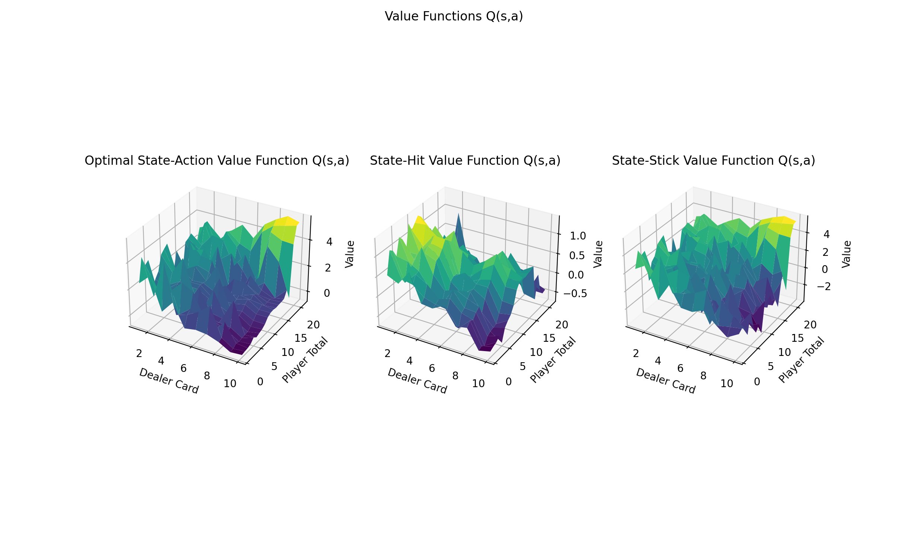

# Assignment 3

## Objective

The objective for this assignment was to solve the Easy21 problem by using Sarsa(λ). After solving for the game, we'll compare the performance against the monte-carlo method by viewing the mean-squared error (MSE) for a range of λ values between 0 and 1.

## How it works

The aproach for this is slightly more technically complicated than the TD(0) approach, but much more powerful. TD(λ) is the unifying theory between TD learning (λ=0) and Monte Carlo methods (λ=1), and gives the flexibility to consider the weighted average return across a variety of n-steps.

In practice this is implemented using the backwards backup so that the algorithm can be used in online simulation. This is accomplished through the use of an eligibility trace. The eligibily trace makes use of a frequency and time-decay heuristic to assign the credit proportionally to its role in recieving some reward. In the code, it is a simple lookup table that is incremented each time a state is visited, and decayed exponentially otherwise at every timestep.

## The Results

<table>
  <tr>
    <th></th>
  </tr>
  <tr>
    <th>
      Figure 1: Value function after 50k iterations
    </th>
  </tr>
</table>

<table>
  <tr>
    <th></th>
  </tr>
  <tr>
    <th>
      Figure 2: Value function after 50k iterations
    </th>
  </tr>
</table>

Here we can see in *Figure 1* that the value function is similar but not identical to that achieved by the Monte-Carlo method.

Looking at *Figure 2* we see that the MSE decays overtime with more iterations, but appears to reach an asymptote around 0.15, which is rather high. It's not entirely obvious why there is such a discrepancy between the two models. While they may convrge on different value functions, the should convery on the ideal policy (which they do not). I suspect this has to do with how the system handles terminal states, and will make an attempt to remedy that in the future.
